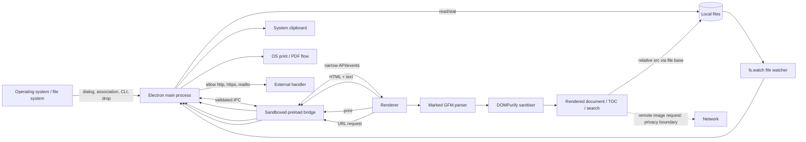

# Chwezi Markdown Reader repository evaluation

Audit date: 2026-07-15  
Checkout: `main` at `7105df42b3021f141e459cfe66dad02582713da6`  
Host: Windows, Node 25.2.1, npm 11.7.0

## 1. Executive verdict

Chwezi Markdown Reader is a coherent **Alpha-ready focused reader**, scoring **57/100**. It already opens, sanitises, presents, searches, prints, watches and richly copies local Markdown in a polished Windows build. The architecture uses Electron's renderer isolation and a narrow preload API. It is suitable for personal use and a controlled beta.

It is not ready for a public professional release. A remote image in an untrusted document makes an automatic network request despite the UI's local-only assurance; an early second-instance request can be lost; refresh resets reading state; the file watcher is fragile for inode-replacing saves on macOS; 1 MB documents can exceed the rich-clipboard limit; and 10–20 MB documents block the renderer for tens of seconds. Installers are unsigned, macOS was not runtime-tested, CI does not run on pull requests or `main`, and the four unit tests cover only rendering helpers.

The right response is a narrow correctness release, not a rewrite. Keep plain TypeScript, extract testable file/watcher, IPC-contract, link/image-policy and clipboard modules, then add reader features only after the foundation is reliable.

## 2. Repository inventory

All 25 tracked files were inspected. The complete tree at the audited commit is:

```text
.github/workflows/build-desktop.yml
.gitignore
LICENSE
README.md
build-resources/icon.png
build-resources/icon.svg
docs/audits/ai-slop-audit.md
docs/delivery-evidence.md
docs/mac-release-readiness.md
package-lock.json
package.json
scripts/clean.cjs
src/main/main.ts
src/main/preload.ts
src/renderer/app.ts
src/renderer/global.d.ts
src/renderer/index.html
src/renderer/markdown.test.ts
src/renderer/markdown.ts
src/renderer/styles.css
tests/artifacts/chwezi-reader-clipboard.html
tests/artifacts/chwezi-reader-clipboard.md
tests/artifacts/chwezi-reader-dark.png
tests/artifacts/chwezi-reader-light.png
tests/fixtures/sample.md
tsconfig.main.json
tsconfig.renderer.json
vite.config.ts
vitest.config.ts
```

Production is one main-process module, one preload, a plain-TypeScript renderer, and one Markdown helper. Marked 18.0.6, DOMPurify 3.4.12 and Zod 4.3.6 are the three runtime dependencies; Electron 43.1.1, electron-builder 26.15.3, Vite 8.1.4, TypeScript 7.0.2, Vitest 4.1.0 and jsdom 26.1.0 are the principal development dependencies (`package.json:22-34`). Electron-builder packages an ASAR, Windows x64 NSIS/portable targets, and macOS x64/arm64 DMG/ZIP targets (`package.json:36-95`). PNG and SVG application icons are present.

The repository has three commits: two documentation-only seeds and one application commit. There are no architectural decision records beyond a decision table in the delivery evidence. Version `1.0.0` is consistent in `package.json`, the lock file and README, but there is no changelog or documented tag/version policy.

Absent: contribution guide, code of conduct, issue/PR templates, security policy, dependency-update automation, linting, formatting, coverage reporting, end-to-end tests, installer smoke tests, checksums, GitHub Release automation, signing credentials/configuration, notarisation entitlements, update/rollback machinery, and release notes generation. Existing audit documents are useful evidence but contain claims, including universal contrast compliance, that runtime/static checks did not confirm (`docs/audits/ai-slop-audit.md`).

## 3. Architecture diagram



The renderer cannot access Node directly (`src/main/main.ts:199-215`). It can, however, request any supported-extension path through `document:read`, and IPC handlers do not authenticate the sender (`src/main/main.ts:291-325`).

## 4. Verified command results

| Command | Exit | Duration | Result |
|---|---:|---:|---|
| `git status --short` | 0 | 0.10 s | Clean before audit |
| `node --version` | 0 | 0.06 s | `v25.2.1` |
| `npm --version` | 0 | 0.62 s | `11.7.0` |
| `npm ci` | 0 | 15.04 s | 366 packages; 0 vulnerabilities; deprecated transitive `inflight`, `rimraf@2`, `glob@7`, `whatwg-encoding`, `boolean` |
| `npm run typecheck` | 0 | 1.97 s | Passed |
| `npm test` | 0 | 6.40 s | 1 file, 4/4 tests; Vitest 4.32 s |
| `npm run build` | 0 | 8.73 s | Passed; renderer JS 79.68 kB, map 266.35 kB |
| `npm audit` | 0 | 5.30 s | 0 vulnerabilities |
| `npm outdated` | 1 | 6.44 s | Updates available: `@types/node` 26.1.1, jsdom 29.1.1, Vitest 4.1.10, Zod 4.4.3 |
| `npm run dist:win` | 0 | 174.59 s | NSIS and portable x64 artifacts produced |

Windows artifacts: `Chwezi Markdown Reader Setup 1.0.0.exe`, 100,252,942 bytes, SHA-256 `C66142013DF53DE6B6A0AB2DD3DD053134B69D13AE1BF4A795982D779C478048`; `Chwezi Markdown Reader Portable 1.0.0.exe`, 100,022,362 bytes, SHA-256 `1B54E73ED4AAC313C1C3ADCF59D7C1F6C2A21DEE99A432B726FDD38AA8C54C3A`. Both report `NotSigned`. The portable app launched with the fixture, exited normally, rendered light/dark captures, and produced 26,808 bytes of HTML plus the exact 762-byte Markdown fallback.

`npm run dist:mac` was not run on Windows. macOS Intel/Apple Silicon launch, Finder association, clipboard, signing and notarisation remain unverified; parsing cross-platform packaging config is not a runtime test. Native GUI automation could not run because the Computer Use native pipe was unavailable. An initial PowerShell print-fixture write failed because `utf8NoBOM` was not accepted, and CDP `Page.printToPDF` was unavailable; an isolated Electron `webContents.printToPDF` harness then succeeded. These failed avenues were not hidden.

## 5. Completeness score

| Category | Score | Evidence and strengths | Missing/full-score requirement |
|---|---:|---|---|
| Core reader functionality | 16/20 | Open/drop/association, GFM, TOC, search, themes, print and three copy modes exist (`src/renderer/app.ts:228-369`) | Safe local navigation, faithful copy across destinations, resilient refresh, explicit profile |
| Reliability and recovery | 8/15 | Errors and file-change events are surfaced (`src/main/main.ts:65-117`) | Atomic-save-safe watch, startup queue, state preservation, delete/move recovery tests |
| Security and privacy | 10/15 | Sandbox, isolation, no Node, navigation denial, Zod and DOMPurify (`src/main/main.ts:199-233`; `src/renderer/markdown.ts:25-37`) | Remote-image control, sender/path grants, hardened fuses/protocol, permission denial |
| UX and accessibility | 9/15 | Strong visual hierarchy, focus rule, responsive layout and reduced motion (`src/renderer/styles.css:56-61,292-326`) | Screen-reader/E2E evidence, active search result, 200% zoom/narrow tests, cross-platform language |
| Performance/large documents | 4/10 | 20 MiB admission limit and synchronous pipeline (`src/main/main.ts:17-18,65-90`) | Responsive 5–20 MB policy, cancellation/progress, bounded DOM/image/copy work |
| Automated testing | 2/10 | Four Markdown helper tests (`src/renderer/markdown.test.ts:4-33`) | IPC, filesystem, DOM, security, E2E, packaged, a11y and platform coverage |
| Packaging/release | 5/10 | Windows and dual-architecture macOS targets; tag workflow (`package.json:49-95`) | PR/main CI, smoke tests, signed/notarised immutable releases, checksums/rollback |
| Documentation/maintainability | 3/5 | README and delivery/mac evidence exist | Changelog, security/contribution docs, decomposed services, accurate evidence maintenance |
| **Total** | **57/100** | **Focused, coherent alpha** | **Correctness patch plus release hardening** |

Readiness verdicts:

| Use | Verdict | Reason |
|---|---|---|
| Internal personal use | Beta ready | Core flows work; known limits are manageable by an informed user |
| Small controlled beta | Alpha ready | Feedback valuable, but privacy/reload/large-copy defects need disclosure |
| Public unsigned download | Not ready | Trust warnings, unverified macOS behaviour, no release integrity or adequate regression suite |
| Public professional distribution | Not ready | Signing/notarisation, platform qualification, security hardening and support process absent |

## 6. Current feature and flow matrix

The observed baseline is verified: Electron/TypeScript/Vite; separate main/preload/renderer; Marked GFM; DOMPurify; Zod at IPC; dialog/drop/association opening; exact-file `fs.watch`; local relative images; light/dark themes; generated TOC; in-document search; progress; printing; selected/full rich copy; Markdown-source fallback; Windows NSIS/portable; macOS x64/arm64 DMG/ZIP configuration; tag build workflow; and four Markdown-helper tests.

| # / flow | Entry and path | Validation/error/state | Tests/gaps |
|---|---|---|---|
| 1 Start empty | `app.whenReady` → `createWindow` → empty view (`main.ts:360-380`) | No file state | Packaged Windows observed; no E2E |
| 2 Toolbar open | button → preload `openFile` → dialog/load (`app.ts:512-515`; `main.ts:291-300`) | extension/size/read errors returned | Manual only |
| 3 Explorer/Finder | association/open-file (`main.ts:333-358`) | single pending path | Windows association not installer-tested; macOS untested |
| 4 CLI | `findMarkdownArgument` (`main.ts:56-63`) | extension only then load validation | Windows packaged observed |
| 5 Second instance | lock + `second-instance` (`main.ts:333-358`) | no ready queue | Confirmed loss at 20–100 ms |
| 6 Drag/drop | drop → webUtils path/readFile or `File.text` (`app.ts:473-497`) | fallback bypass hypothesis | Manual fixture only |
| 7 Manual reload | command → current path read (`app.ts:499-510`) | error toast; resets render state | No automated test |
| 8 Auto reload | `fs.watch` → event → display (`main.ts:93-117`; `app.ts:589-594`) | 120 ms debounce; watcher closes on error | Windows probes; macOS untested |
| 9 Search | text-node TreeWalker/highlights (`app.ts:371-447`) | query state; no API fallback | No tests |
| 10 TOC | generated IDs and links (`app.ts:175-201`) | duplicate `-2` suffix | No tests |
| 11 Heading link | browser fragment navigation (`app.ts:203-225`) | sanitised href | No duplicate/non-Latin fixtures |
| 12 Web/mail link | click → preload → shell (`app.ts:203-225`; `main.ts:311-314`) | Zod + http/https/mailto allowlist | Sanitiser probe only |
| 13 Relative Markdown | treated as external (`app.ts:203-225`) | rejected by main URL policy | Confirmed incomplete |
| 14 Relative image | `<base>` file directory (`app.ts:228-253`) | DOMPurify; broken-image class | Sample only |
| 15 Remote image | renderer network load | CSP explicitly allows HTTP/S (`index.html:7-10`) | Confirmed tracking request |
| 16 Selection copy | copy event/selection clone (`app.ts:276-359`) | 10 MiB HTML/text IPC schema | No destination integration |
| 17 Full rich copy | document clone + inline styles (`app.ts:276-359`) | 10 MiB ceiling | Confirmed valid 1 MB input can fail |
| 18 Markdown source | current source → text clipboard (`app.ts:336-359`) | no explicit main size schema | Windows artifact matched |
| 19 Print | renderer command → `webContents.print` (`main.ts:305-309`) | generic error handling | 17-page PDF probe; no platform E2E |
| 20 Theme | localStorage + root dataset (`app.ts:99-118`) | saved choice wins; otherwise OS dark or light default | Light/dark captures only; system-default E2E absent |
| 21 Resize | CSS grid/media query (`styles.css:175-196,292-314`) | sidebar hidden at 850 px | No zoom/narrow visual tests |
| 22 Reopen | no recent/last-document store | theme only persists | Feature absent |

## 7. Defects and fragility findings

### [High] Remote images silently cross the privacy boundary

**Status:** Confirmed  
**Evidence:** `src/renderer/index.html:7-10`; `src/renderer/index.html:67`; `src/renderer/app.ts:203-225`  
**Affected platforms:** Both  
**User impact:** Opening an untrusted Markdown file can disclose IP address, timestamp, app/Electron user agent and a document-specific tracking token.  
**Technical explanation:** CSP permits HTTP/S images and rendered `` elements load automatically, while the empty-state promise says the document stays on the computer. A local test server received the request.  
**Reproduction or verification steps:** Open Markdown containing `` and inspect the server request.  
**Recommended remediation:** Block remote images by default; add a global setting, visible blocked-content indicator, and ephemeral “load for this document” action.  
**Regression tests:** E2E request interception must show zero network before consent and only image HTTP/S after consent.  
**Suggested release:** 1.0.1

### [High] A valid document can open but cannot be richly copied

**Status:** Confirmed  
**Evidence:** `src/main/main.ts:17-18`; `src/main/main.ts:28-31`; `src/renderer/app.ts:276-334`  
**Affected platforms:** Both  
**User impact:** The product's signature copy operation fails on a generated 1 MB document.  
**Technical explanation:** Input allows 20 MiB, but computed styles inflate cloned HTML beyond the independent 10 MiB clipboard schema. The toast incorrectly suggests the document is still being read.  
**Reproduction or verification steps:** Open the 1 MB composite fixture and invoke full rich copy; packaged Chromium rejected the payload after about 1.56 s.  
**Recommended remediation:** Define one measured output policy, estimate/measure before IPC, optimise styles, provide a precise fallback, and make rendered plain text the rich-copy text flavour while preserving “Copy Markdown source” separately.  
**Regression tests:** Boundary fixtures for input, HTML and text; paste/golden tests for both successful and fallback paths.  
**Suggested release:** 1.0.1

### [High] Early second-instance file requests are lost

**Status:** Confirmed  
**Evidence:** `src/main/main.ts:51-63`; `src/main/main.ts:217-233`; `src/main/main.ts:333-358`  
**Affected platforms:** Windows  
**User impact:** Double-clicking another Markdown file during startup can leave the app showing no document.  
**Technical explanation:** `open-file` has one pending slot, but `second-instance` sends immediately even when the window or renderer is not ready. Tests at 20 ms and 100 ms lost the request; 300 ms and later succeeded.  
**Reproduction or verification steps:** Launch the packaged app, then launch it with a Markdown argument within 100 ms.  
**Recommended remediation:** Use a FIFO startup/open queue drained only after renderer-ready acknowledgement; coalesce exact duplicates only.  
**Regression tests:** E2E launches multiple files before/during/after renderer readiness and asserts order and final active document.  
**Suggested release:** 1.0.1

### [High] Large documents synchronously freeze the renderer

**Status:** Confirmed  
**Evidence:** `src/renderer/app.ts:228-253`; `src/renderer/app.ts:276-334`; `src/renderer/markdown.ts:25-37`  
**Affected platforms:** Both  
**User impact:** The app appears hung for seconds to tens of seconds, and copy can add another multi-second stall.  
**Technical explanation:** Parsing, sanitising, DOM insertion, TOC generation, image resolution and clipboard styling all run synchronously. Packaged Chromium reached ready at ~2.14 s/1 MB, 7.72 s/5 MB, 18.93 s/10 MB and 43.41 s/19.9 MB; the last fixture produced 641,877 elements.  
**Reproduction or verification steps:** Open the composite prose/table/code/list/image fixtures and measure ready state and input latency.  
**Recommended remediation:** Set an honest responsive limit now, show progress/cancel, cap pathological structure, and investigate worker parsing plus incremental/batched rendering before raising it.  
**Regression tests:** Performance budgets for 1/5/10/20 MB fixtures with responsiveness probes and memory ceilings on both platforms.  
**Suggested release:** 1.0.1 and 1.1

### [Medium] Exact-file watching is unreliable for common atomic saves

**Status:** Confirmed on Windows; macOS failure mode supported by Node documentation and requires runtime verification  
**Evidence:** `src/main/main.ts:93-117`  
**Affected platforms:** Both  
**User impact:** Changes, deletes or recreations may stop refreshing without a useful recovery path.  
**Technical explanation:** The app watches the file inode/path directly. Windows probes detected direct writes, replace, delete, recreate and rename; Node documents inconsistent `fs.watch` behaviour and inode replacement semantics on macOS/Linux. Watcher errors merely close the watcher.  
**Reproduction or verification steps:** Exercise direct and temp-file-replace saves, rename/move/delete/permission/recreate, rapid writes and stale debounce against real Windows/macOS editors.  
**Recommended remediation:** Watch the parent directory, filter the basename, debounce with a document generation token, re-stat/retry on replacement, and report recoverable states. Add Chokidar only if native cross-platform tests justify it.  
**Regression tests:** Temporary-filesystem integration matrix plus packaged editor-save smoke tests on Windows and macOS.  
**Suggested release:** 1.0.1

### [Medium] Refresh destroys reading and search context

**Status:** Confirmed  
**Evidence:** `src/renderer/app.ts:228-253`; `src/renderer/app.ts:371-447`; `src/renderer/app.ts:589-594`  
**Affected platforms:** Both  
**User impact:** An editor save jumps the reader to the top, clears selection and results, and resets progress.  
**Technical explanation:** Every render calls `clearSearch()` and sets `scrollTop = 0`; replacing `innerHTML` invalidates selections. The query string and TOC collapsed state remain, creating inconsistent state.  
**Reproduction or verification steps:** Scroll, select text, search, choose a result, then modify the file.  
**Recommended remediation:** For same-document refresh preserve heading ID plus offset, falling back to percentage; rerun the query; retain the nearest matching result; preserve selection only if a stable text anchor still exists; recompute progress; preserve TOC state. Reset all on a different document.  
**Regression tests:** Acceptance tests for each state item, changed/missing anchors and an old debounce firing after document switch.  
**Suggested release:** 1.0.1

### [Medium] IPC trusts any renderer and grants path reads broadly

**Status:** Confirmed  
**Evidence:** `src/main/main.ts:291-325`; `src/main/preload.ts:14-38`; `src/renderer/global.d.ts:1-25`  
**Affected platforms:** Both  
**User impact:** A future renderer compromise could read any `.md`/`.markdown` path known or guessed by the attacker and use privileged clipboard/shell operations.  
**Technical explanation:** Inputs are schema-validated, but handlers do not validate `event.senderFrame`; `document:read` is not limited to dialog, association or navigation grants. CSP `connect-src 'none'` and protocol allowlisting reduce exfiltration but do not make the boundary correct.  
**Reproduction or verification steps:** Invoke handlers from the current renderer with an arbitrary supported path.  
**Recommended remediation:** Validate the top-frame sender/origin, track granted canonical paths, make privileged actions user-gesture scoped where practical, and share one typed IPC contract.  
**Regression tests:** Rejection tests for subframes, unexpected URLs, ungranted paths, traversal/case/symlink cases and malformed payloads.  
**Suggested release:** 1.0.1

### [Medium] Production hardening is incomplete

**Status:** Confirmed  
**Evidence:** `vite.config.ts:7-12`; `package.json:36-47`; `src/main/main.ts:199-233`  
**Affected platforms:** Both  
**User impact:** A local tampering or renderer-compromise scenario gains additional capability, and shipped source is easier to inspect than necessary.  
**Technical explanation:** Packaged source maps are present; `file://` is privileged; ASAR integrity and only-load-from-ASAR are disabled; RunAsNode, `NODE_OPTIONS`, CLI inspect and extra file-protocol privileges are enabled. Context isolation/sandbox/no-Node and navigation denial are strong existing mitigations.  
**Reproduction or verification steps:** Inspect the ASAR and run `electron-fuses read` against the packaged executable.  
**Recommended remediation:** Remove production maps, configure/test fuses and ASAR integrity, default-deny permissions, and plan a scoped custom protocol without breaking authorised relative images.  
**Regression tests:** Packaged fuse/ASAR assertions, tamper test, no-source-map assertion and local-image protocol tests.  
**Suggested release:** 1.0.1

### [Medium] Encoding errors are silently rendered as corrupted text

**Status:** Confirmed  
**Evidence:** `src/main/main.ts:65-90`  
**Affected platforms:** Both  
**User impact:** Invalid UTF-8 and UTF-16 appear as replacement characters/NULs rather than an actionable error.  
**Technical explanation:** `readFile(..., "utf8")` replaces invalid sequences; only a leading Unicode BOM character is stripped. Valid UTF-8 BOM, CR/LF variants, RTL, combining characters, emoji and non-Latin content worked.  
**Reproduction or verification steps:** Open invalid UTF-8 and UTF-16 LE/BE fixtures.  
**Recommended remediation:** Remain explicitly UTF-8-only; decode with fatal validation, recognise UTF-16 BOMs, and explain conversion options.  
**Regression tests:** Encoding/newline/long-line/RTL/combining/emoji/non-Latin fixture matrix.  
**Suggested release:** 1.0.1

### [High] Public release integrity and platform qualification are absent

**Status:** Confirmed  
**Evidence:** `.github/workflows/build-desktop.yml:3-55`; `package.json:49-95`; `docs/mac-release-readiness.md`  
**Affected platforms:** Both  
**User impact:** Users receive unsigned binaries; macOS users will face trust friction, and regressions can merge without CI.  
**Technical explanation:** CI runs only by dispatch/tag, does not explicitly typecheck, builds but does not launch installers, keeps artifacts 14 days, disables mac certificate discovery, and creates no release/checksums. Action tags are mutable. Windows outputs were `NotSigned`; macOS was not run.  
**Reproduction or verification steps:** Inspect workflow triggers/jobs and executable signatures; attempt clean-machine installs.  
**Recommended remediation:** Add PR/main gates, pin actions to full commit SHAs, smoke-test packages, build once for release candidates, sign Windows, sign/notarise macOS with hardened runtime/entitlements, publish checksums and promote identical approved artifacts.  
**Regression tests:** Clean VM install/upgrade/uninstall/association/portable tests and native Intel/Apple Silicon smoke tests.  
**Suggested release:** 1.0.1 release infrastructure

## 8. Security and privacy audit

| Severity/status | Boundary and scenario | Existing mitigation | Remediation/test |
|---|---|---|---|
| High/confirmed | Remote images beacon on open | Scripts removed; connect-src none | Block by default; request-interception E2E |
| Medium/confirmed | IPC sender/path authorisation | Zod schemas; isolated preload | sender/top-frame + canonical grant tests |
| Medium/confirmed | `file://`, permissive fuses, no ASAR integrity | sandbox/no Node/navigation denial | scoped protocol, fuse/tamper packaged tests |
| Medium/confirmed | Production source maps in ASAR | none | disable maps for release; archive-symbol policy |
| Medium/confirmed | Clipboard HTML privileged write from renderer | size schema; rendered DOM sanitised | re-sanitise/contract policy, sender validation, malicious HTML tests |
| Low/confirmed | `stat` then `readFile` TOCTOU can exceed 20 MiB | pre-read stat | file-handle/post-read byte check and replace/grow race test |
| Low/hypothesis | Symlink follows target outside selected directory | explicit user open, extension/size checks | document behaviour; canonical grant test, do not overstate local risk |
| Low/confirmed | No permission request handler | current Markdown scripts removed | default deny and camera/mic/geolocation/notification tests |
| Informational | DOMPurify strips script/event/style and unsafe anchor schemes; data images remain | forbidden active tags and attributes (`markdown.ts:25-37`) | fixture-based URL/SVG/data regression suite; consider blocking SVG/data by image policy |
| Informational | Future updater could become a supply-chain boundary | no updater exists | do not add until signed immutable releases and rollback exist |

External links are limited to parsed HTTP, HTTPS and mailto URLs (`main.ts:33-40`), and navigation/new windows are denied. Relative Markdown/PDF/local-file links therefore do not work. A safe future policy should open authorised `.md`/`.markdown` in-reader with history, open explicitly confirmed local non-Markdown files through the OS, open only allowed external schemes on user gesture, and reject JavaScript, data, file, protocol-relative and unknown schemes. Duplicate slug numbering begins at `-2`, so GitHub fragment compatibility is incomplete (`app.ts:175-201`).

For images, relative local files work; absolute file URLs are sanitised out; HTTP/S and PNG/SVG data images survive; raw SVG and event attributes are removed. Missing images get a visual error state. There is no dimension/byte guard, and local image paths copied into HTML are not portable. Remote URLs copied into HTML can retrigger tracking. Recommended policy: **block remote images by default**, expose a global opt-in plus prominent document indicator, and allow a one-document load action without persistence. This best matches the private-reader promise.

## 9. Accessibility and UX assessment

Strengths include native buttons, labels, landmarks, a live loading region, alert error panel, visible focus, reduced-motion handling and responsive sidebar removal (`index.html:15-97`; `styles.css:56-61,292-326`). Keyboard commands exist in the menu (`main.ts:120-170`). The editorial layout and both themes were visually coherent in captured Windows runs.

Gaps requiring assistive-technology and platform testing:

- Light-theme `--faint` contrast is approximately 3.36:1 and is used for 10–11 px text, below WCAG 2.2 AA normal-text contrast; other measured key pairs pass.
- Search results share one highlight; the active result is not distinct. Without the CSS Custom Highlight API the count can report matches while navigation reports `0 of N` (`app.ts:371-435`). Matches cannot cross inline-element boundaries.
- Search opens then calls `focus()` on a non-focusable reader section (`index.html:61`; `app.ts:437-447`). Search/status changes need screen-reader verification.
- Footer shortcuts are hard-coded as `Ctrl`, and missing-file/read errors say “Windows” on macOS (`index.html:88-92`; `app.ts:132-145`). Native menus carry equivalent commands but presentation is not platform-aware.
- The View menu already uses Electron's native fullscreen role (`src/main/main.ts:151-159`), but explicit `Esc` exit and state-restoration behaviour are not tested.
- TOC semantics are reasonable, but active heading, scroll synchronisation and duplicate/non-Latin heading behaviour are absent. Heading hierarchy follows document input, so the app should not silently rewrite author semantics.
- 200% zoom, high-contrast/forced-colour mode, VoiceOver, Narrator, logical tab order, long filenames, RTL layout, narrow windows, touchpad and keyboard scrolling remain unverified.

## 10. Performance, encoding, clipboard and print assessment

The large-file fixtures combined long prose, tables, thousands of headings, large code blocks, many local-image references and deeply nested lists. Packaged Chromium timings are recorded in the high finding above. A jsdom diagnostic measured parse/sanitise/insert/search/copy work and exceeded a ~1 GB RSS delta at 10 MB; its 20 MB run ended with V8 heap OOM after 114.8 s. jsdom is not Chromium, so these figures diagnose scaling rather than predict desktop memory exactly.

Search supports multiple matches within one text node, code, tables, RTL and exact Unicode strings. It does not match across inline elements; locale lowercase is not a complete Unicode/Turkish case-folding policy; accents are exact. Large-document search adds synchronous traversal. The active result needs a separate highlight and a DOM fallback.

Clipboard strengths are structural cloning, computed-style mapping, HTML/text formats and separate Markdown-source copy. Risks are order-based style mapping for partial nested selections, dark-theme child colours where destinations strip the dark wrapper, nonportable local images, tracking remote images and the size mismatch. Word, Outlook, Gmail, Google Docs, LibreOffice, Slack and plain-editor paste fidelity could not be tested on this host. The full-rich-copy plain-text flavour should be **rendered plain text**; original Markdown remains a separate explicit command. Add a light/neutral clipboard theme by default.

A 47.7 kB print fixture produced a 243,804-byte, 17-page A4 PDF. Dark mode printed with a white background and readable body/table content. Long code lines were clipped with a printed scrollbar; missing images showed broken placeholders; URLs were not expanded; there were no headers, footers or page numbers; pagination had weak heading/orphan control; the PDF was untagged. Print is adequate for basic use after CSS fixes. Explicit PDF export is useful for predictable naming/options; self-contained HTML export offers more distinctive reader value and should precede elaborate PDF tooling.

## 11. Maintainability assessment

Plain TypeScript is not the problem. The issue is responsibility concentration: `main.ts` combines lifecycle, menus, About, file IO, watching, window policy, capture hooks and IPC; `app.ts` combines UI state, rendering, navigation, search, TOC, drag/drop, copy serialisation and commands. IPC interfaces are duplicated in `preload.ts:3-12` and `global.d.ts:1-25`, while runtime schemas live elsewhere.

Extract only where there is a concrete testing/maintenance benefit:

- **Shared IPC contracts now:** one channel/schema/type source prevents drift and enables contract tests.
- **File service and watcher service now:** isolate TOCTOU, grants, atomic saves, debounce generations and filesystem fixtures.
- **Link and image policies now:** one auditable decision point for parser output, click handling, CSP and privacy UI.
- **Clipboard serializer now:** directly protects the product's differentiator with fixture and size tests.
- **Markdown pipeline now:** enables timing, structure limits and later worker exploration.
- **Search service now:** supports active/fallback/cross-inline behaviour without DOM-event sprawl.
- **Navigation service in 1.1:** justified when relative documents and history arrive.
- **Settings store in 1.1:** justified when recent files, appearance and remote-image preference need migration/versioning.

Do not add a UI framework or generic state library until demonstrated complexity requires it. Centralise user-facing errors into platform-neutral typed error codes, add privacy-safe diagnostic logging, split CSS by application chrome/reader/print when print and appearance work begins, and keep the supported Markdown profile explicit.

## 12. Platform readiness

Windows x64 portable launch and rendering were exercised; installer install/upgrade/uninstall, file association ownership, portable app-data behaviour and clean-VM reputation prompts were not. Windows ARM64 is not configured. macOS has x64/arm64 package configuration but no host execution, signature, notarisation, Gatekeeper, Finder association, Intel or Apple Silicon evidence. Linux is out of current scope.

The current workflow runs tests and packaging on Windows/macOS only for tags or manual dispatch (`.github/workflows/build-desktop.yml:3-55`). It does not prove packaged launch, copy, file association, printing, installation or upgrades. Public distribution requires native qualification, Authenticode, Apple Developer ID signing and notarisation. Automatic updates must wait until artifact identity, signing, promotion and rollback are reliable.

## 13. Top ten recommended actions

1. Block remote images by default and correct the privacy promise.
2. Replace exact-file watching with tested parent-directory watching and recoverable file states.
3. Add a renderer-ready FIFO for association/CLI/second-instance opens.
4. Preserve heading/offset, query/result and defensible selection state on same-file reload.
5. Reconcile document/clipboard limits and make copy failure precise and recoverable.
6. Add PR and `main` CI with explicit typecheck, tests, builds and pinned action SHAs.
7. Build filesystem, IPC-security and Electron E2E regression suites before new features.
8. Set responsive large-document budgets, show progress/cancel and investigate off-main-thread parsing.
9. Validate IPC senders/path grants and harden packaged fuses, ASAR integrity, protocol and source maps.
10. Establish signed Windows and signed/notarised macOS release candidates tested on native hardware.

Primary external references accessed 2026-07-15: [Electron security](https://www.electronjs.org/docs/latest/tutorial/security), [Electron fuses](https://www.electronjs.org/docs/latest/tutorial/fuses), [Electron ASAR integrity](https://www.electronjs.org/docs/latest/tutorial/asar-integrity), [Node `fs.watch`](https://nodejs.org/api/fs.html#fswatchfilename-options-listener), [GitHub Actions secure use](https://docs.github.com/en/actions/reference/security/secure-use), [Apple Developer ID](https://developer.apple.com/developer-id/), [Apple notarisation](https://developer.apple.com/documentation/security/notarizing-macos-software-before-distribution), and [WCAG 2.2](https://www.w3.org/TR/WCAG22/). No archived snapshots were created; repository evidence and command outputs are the primary audit record.
